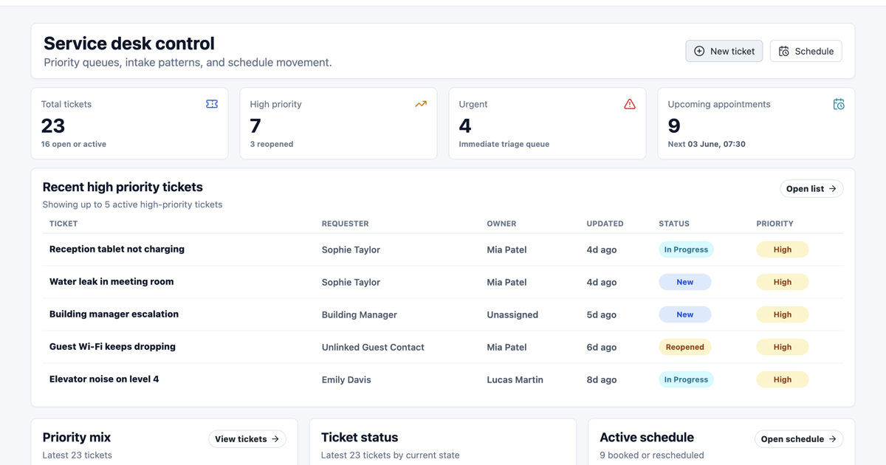

# Jie Zhang

Backend-focused full-stack developer based in regional Australia.

I work mainly with Java, Spring Boot, PostgreSQL, Keycloak/OAuth2, Docker, React, and TypeScript. My current portfolio focus is **Multiapp**, a deployed multi-tenant ticketing and appointment SaaS demo.

## Main Project

### Multiapp - Multi-tenant Ticketing & Appointment SaaS

- Live demo: [https://multiapp-frontend.pages.dev](https://multiapp-frontend.pages.dev)
- Backend repository: [https://github.com/jastoninfer/multiapp-backend](https://github.com/jastoninfer/multiapp-backend)
- Frontend repository: [https://github.com/jastoninfer/multiapp-frontend](https://github.com/jastoninfer/multiapp-frontend)

Multiapp is a SaaS demo for service desk work. It supports tickets, appointments, resources, contacts, tenant members, tenant switching, role-based pages, audit logs, and user profile flows.

## Demo Login

All demo accounts use `Demo123!`.

| Role | Account | What to check |
| --- | --- | --- |
| Tenant admin | `tenant.admin@acme.demo` | Dashboard, tickets, appointments, members, tenant settings, audit logs |
| Agent | `agent@acme.demo` | Ticket owner changes, comments, contacts, scheduling |
| Resource user | `resource@acme.demo` | Appointments and availability |
| Customer | `customer@acme.demo` | Customer ticket view |

## What To Review

**Backend**

- Tenant request context: `common/tenant`
- Authorization rules: `*/auth`
- Ticket workflow: `ticket`
- Appointment and availability rules: `appointment`, `resource`
- Idempotency, audit, outbox, rate limiting: `idempotency`, `audit`, `outbox`, `common/ratelimit`
- Database migrations and seed data: `src/main/resources/db/migration`, `demo`
- CI/CD: `.github/workflows/backend-ci-cd.yml`

**Frontend**

- Login, PKCE, token refresh: `src/auth`
- API client and tenant headers: `src/api/client.ts`
- Role-aware layout: `src/components/Layout.tsx`
- Ticket and appointment pages: `src/pages`, `src/components`
- Query keys and cache refresh: `src/queryKeys.ts`, `src/cache`
- CI/CD: `.github/workflows/frontend-ci-cd.yml`

## CI/CD Summary

CI/CD means the project is checked and deployed through a repeatable pipeline instead of manual one-off steps.

For this project:

- Backend CI runs tests and builds a Docker image.
- Backend CD deploys the `main` branch to a VPS through GitHub Actions secrets, restarts Docker Compose, and runs a health check.
- Frontend CI installs dependencies and builds the Vite app.
- Frontend CD deploys the static build to Cloudflare Pages and runs a smoke test.

The README files inside the frontend and backend repos include the setup details without exposing private server values.

## Technical Focus

**Backend:** Java, Spring Boot, Spring Security, REST APIs, JPA/Hibernate  
**Database:** PostgreSQL, Flyway, SQL, MySQL, Redis, Elasticsearch  
**Frontend:** TypeScript, React, Vite, React Router, TanStack Query  
**DevOps:** GitHub Actions, Docker, Docker Compose, Caddy, Linux VPS, Cloudflare Pages  
**Other:** C/C++, Python, OpenMP, CMake

## Background

- Master of Information Technology, Charles Darwin University
- Bachelor of Computer Science, Beihang University
- Graduate-level data science study, Peking University
- Engineering experience through Meituan and Huawei

## Contact

- LinkedIn: [https://www.linkedin.com/in/jie-zhang-jastoninfer/](https://www.linkedin.com/in/jie-zhang-jastoninfer/)
- Email: astoninfer@gmail.com
